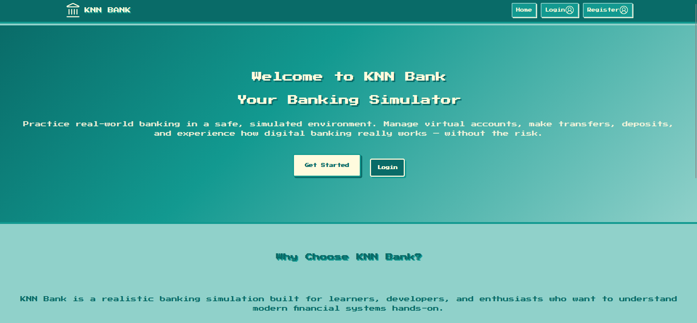
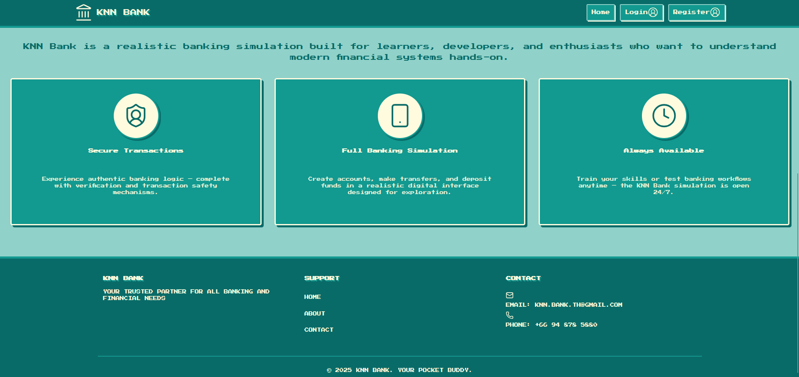
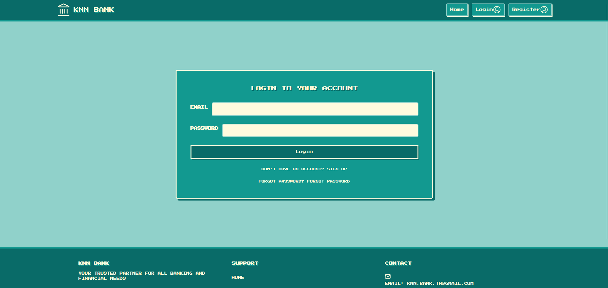
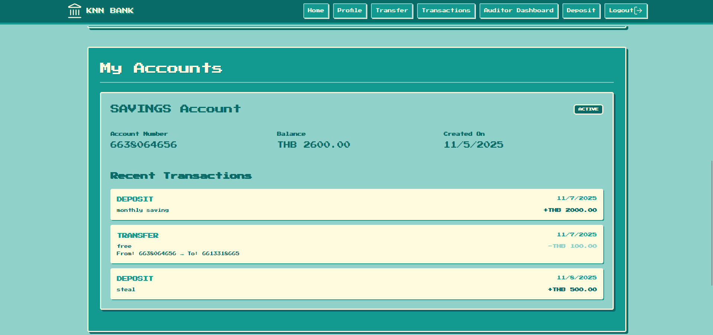
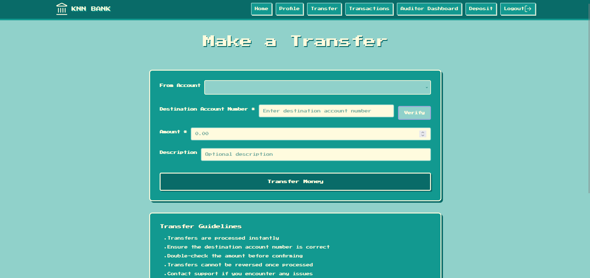
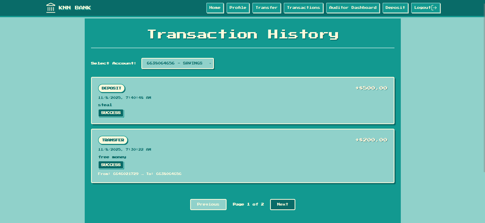
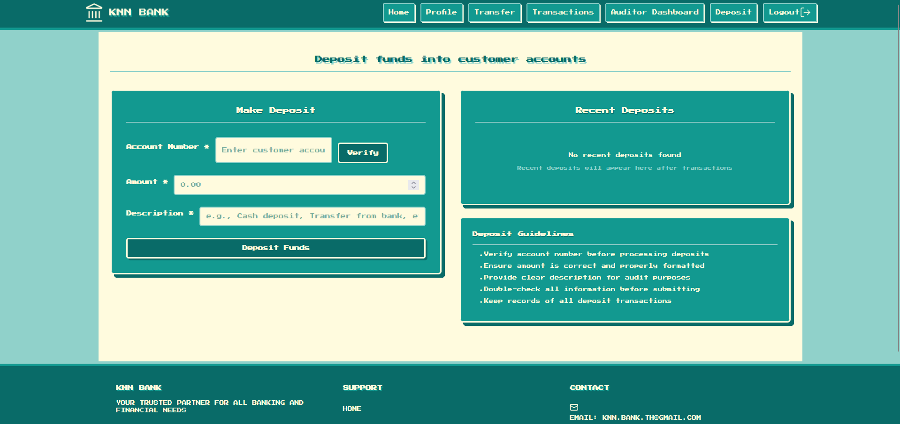
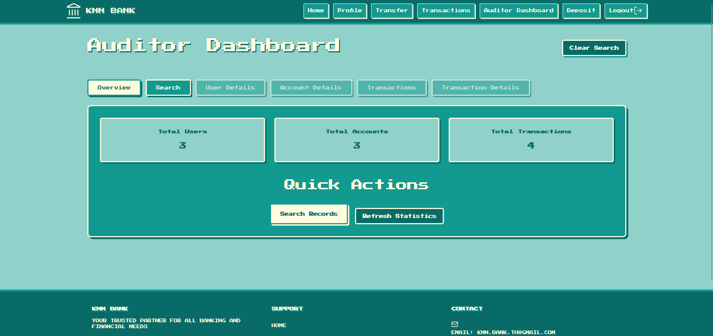

# Frontend for Banking Simulation Web Application

This is the **frontend** deploy on AWS S3 for the banking simulation project. It pairs with the backend server (Spring Boot + MySQL/Aurora/RDS) to provide a full-stack experience: users can register/login, view their accounts & transactions, upload a profile picture, and interact via a modern UI built with React.

---

[<--KNN-Banking-Simulation-->](http://knnbank-frontend-deploy.s3-website-ap-southeast-2.amazonaws.com)

---

## 🎯 Purpose

- Serve as the user interface for the banking simulation using the backend APIs.
- Demonstrate portfolio-ready frontend architecture and UX design.
- Provide an interactive multi-page application that communicates with the backend endpoints.
- Showcase modern frontend tooling, state management, responsive design, and API integration.

---

## 🧮 Tech Stack

- **React**
- JavaScript
- CSS
- Axios for API calls
- React Router for client-side navigation
- State management
- UI/UX focused design — responsive layout, mobile + desktop

---

## 📁 Project Structure

```
knn-bank-react/
├─ public/
│ └─ index.html
├─ src/
│ ├─ components/
│ ├─ pages/
│ ├─ service/
│ ├─ index.css
│ └─ App.js
├─ package.json
└─ README.md
```

---

## 🖥️ UX & Features

- Authentication pages: login & register
- Dashboard: summary of accounts and transactions
- Transactions page: show history, pagination
- Profile page: view/edit profile + upload/change profile picture via S3 (backend handles S3 upload)
- Admin pages : users management, audit logs
- Responsive design: desktop + mobile friendly

---

## Website Images

## 

## 

## 

## 

## 

## 

## 

## 


